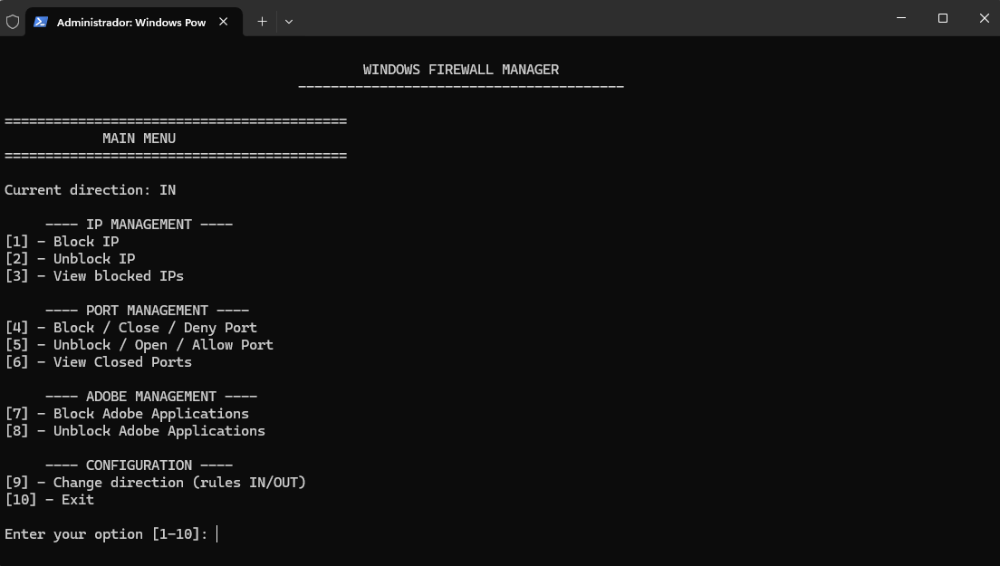

  
# Simple Windows Firewall Manager + Adobe Manager

A collection of ".bat" scripts to manage Windows Firewall rules focused on:
- Block/unblock IP addresses (IN/OUT).
- Block/unblock ports (TCP/UDP).
- Detect and block **Adobe** executables from internet access by creating program-specific rules.
---

## Language Support
This project includes versions in separate files:
- `firewall-manager-en.bat` - English (EN)
- `firewall-manager-es.bat` - Spanish (ES)
- `firewall-manager-fr.bat` - French (FR)
- `firewall-manager-it.bat` - Italian (IT)
- `firewall-manager-pt.bat` - Portuguese (PT)

## Preview

## Compatibility
- **Windows**: All versions (7, 8, 8.1, 10, 11)
- **Windows Server**: All versions (2008, 2012, 2016, 2019, 2022)
- **Architecture**: Both x86 and x64 systems

## Usage

### Method 1: Simple Right-Click (Recommended for beginners)
1. Download the batch file (.bat) in your preferred language
2. Right-click on the downloaded file
3. Select **"Run as administrator"**

### Method 2: Using Command Line
1. Download the batch file (.bat) in your preferred language
2. Copy the full path where you saved the file (e.g., `C:\Users\YourName\Downloads\`)
3. Open one of the following as administrator:
   - **Windows Terminal** (recommended)
   - **Command Prompt (CMD)**
   - **PowerShell**
4. Navigate to the file location using "**cd**" and run file
---

## Contributing & Support

Found this tool useful? Here's how you can support the project:
- **Star this repository ⭐** if it was helpful to you
- **Report bugs** or suggest improvements via Issues
- **Share** with others who might benefit from this tool
---
